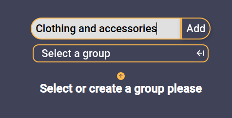
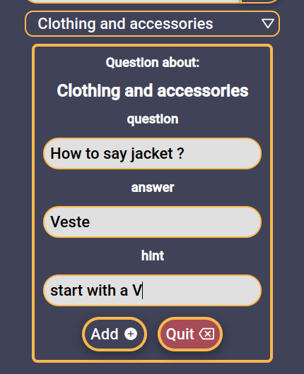
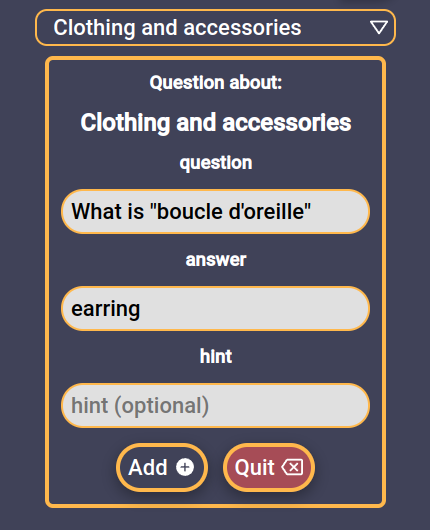
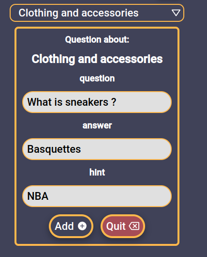
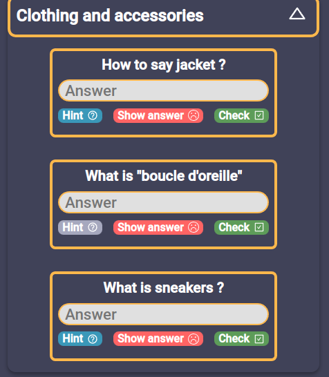

# Pardon my French

---

### Pardon my French is a free and open source application that you can use for studying french, but there is tool that you can use for studying any kind of things. The app will be updated every week with new features and tools not only for helping to learn french but about productivity in general for exemple:

- Create your own quizz
- Create memo for french conjugation(maybe soon in other languages)
- taking vocal note or using this to train your prononciation
- Exercices pre-created by the app will be added and challenge
- visualise your progress with your quizz and other results
- todo list
- list ressources
  And alot more...

## How to acces

---

So far unfortunately the app is not on my own domain but you can access here in this link:
https://fang44zen.github.io/pardonmyfrench/

You can create your account with google or you can create it with email and password. All your information are protected by google services, the back end architecture is based on Firebase. You will not receive anymail from the app.

## How to use it

---

For now there is not alot of tools, but here is a quick view. Once you created your account and you're connected, you can go to the "Create Exercises" page and select the one that you want.

### Create Questions:

Instead of adding a thousand of questions and having a giant list with no order. Then you can create group of question and sort then into a theme.Let's say you are studying french and you just finished the course about clothes and accessories.

Click on "add" and now you can see "select group" has changed, and a form has appeared. Now you just have to follow your imagination:

 

and then if you go to Exercices -> Questions

(Soon an input will be added then you can search all around your groups or questions)
